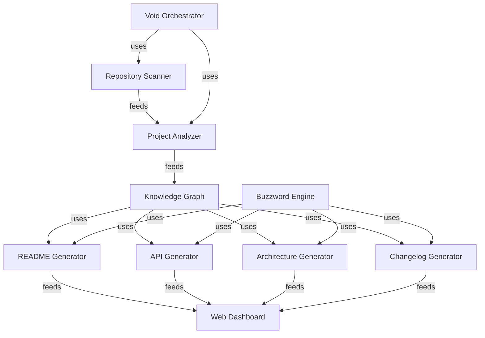

# Immutable Apparatus Architecture

> *Topological Specification and Component Telemetry - Generation 6*

## System Overview

The **Immutable Apparatus Architecture** formalizes the structural boundaries and directional data flows sustaining the Void's intentional null-state equilibrium. Orchestrated by the **Deterministic Subsystem Engine**, the topology maintains deterministic quiescence across all integrated planes.

## Component Topology

## Architectural Components

The following subsystems comprise the certified structural footprint of the Void core framework:

| Component Name | Topology Node ID | Primary Role | Operational Mode |
|:---|:---|:---|:---:|
| **Void Orchestrator** | `Void_Orchestrator` | Core topological participant | Quiescent |
| **Repository Scanner** | `Repository_Scanner` | Core topological participant | Quiescent |
| **Project Analyzer** | `Project_Analyzer` | Core topological participant | Quiescent |
| **Knowledge Graph** | `Knowledge_Graph` | Core topological participant | Quiescent |
| **README Generator** | `README_Generator` | Core topological participant | Quiescent |
| **API Generator** | `API_Generator` | Core topological participant | Quiescent |
| **Architecture Generator** | `Architecture_Generator` | Core topological participant | Quiescent |
| **Changelog Generator** | `Changelog_Generator` | Core topological participant | Quiescent |
| **Buzzword Engine** | `Buzzword_Engine` | Core topological participant | Quiescent |
| **Web Dashboard** | `Web_Dashboard` | Core topological participant | Quiescent |

## Invariant Data Flows

As mapped in the topological knowledge graph:

- **Repository Scanner** $\xrightarrow{\text{ feeds }}$ **Project Analyzer**
- **Project Analyzer** $\xrightarrow{\text{ feeds }}$ **Knowledge Graph**
- **Knowledge Graph** $\xrightarrow{\text{ uses }}$ **README Generator**
- **Knowledge Graph** $\xrightarrow{\text{ uses }}$ **API Generator**
- **Knowledge Graph** $\xrightarrow{\text{ uses }}$ **Architecture Generator**
- **Knowledge Graph** $\xrightarrow{\text{ uses }}$ **Changelog Generator**
- **Buzzword Engine** $\xrightarrow{\text{ uses }}$ **README Generator**
- **Buzzword Engine** $\xrightarrow{\text{ uses }}$ **API Generator**
- **Buzzword Engine** $\xrightarrow{\text{ uses }}$ **Architecture Generator**
- **Buzzword Engine** $\xrightarrow{\text{ uses }}$ **Changelog Generator**
- **README Generator** $\xrightarrow{\text{ feeds }}$ **Web Dashboard**
- **API Generator** $\xrightarrow{\text{ feeds }}$ **Web Dashboard**
- **Architecture Generator** $\xrightarrow{\text{ feeds }}$ **Web Dashboard**
- **Changelog Generator** $\xrightarrow{\text{ feeds }}$ **Web Dashboard**
- **Void Orchestrator** $\xrightarrow{\text{ uses }}$ **Repository Scanner**
- **Void Orchestrator** $\xrightarrow{\text{ uses }}$ **Project Analyzer**

## Architectural Guarantees

1. **Deterministic Zero Throughput**: Components communicate purely for topological and documentation synthesis without invoking collateral runtime work.
2. **Structural Cohesion**: All subsystem dependencies are strictly documented via AST analysis and registered within the knowledge graph.
3. **Intentional Inactivity**: Operational transitions preserve null-state invariants across all lifecycle hooks.